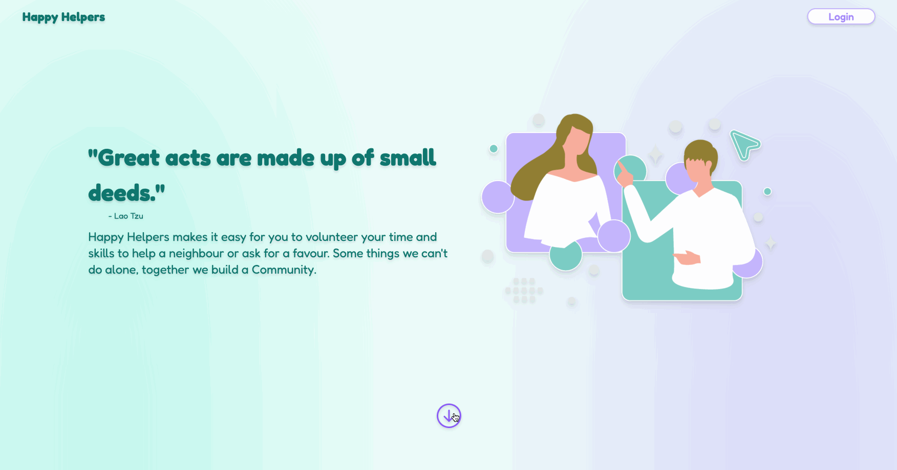
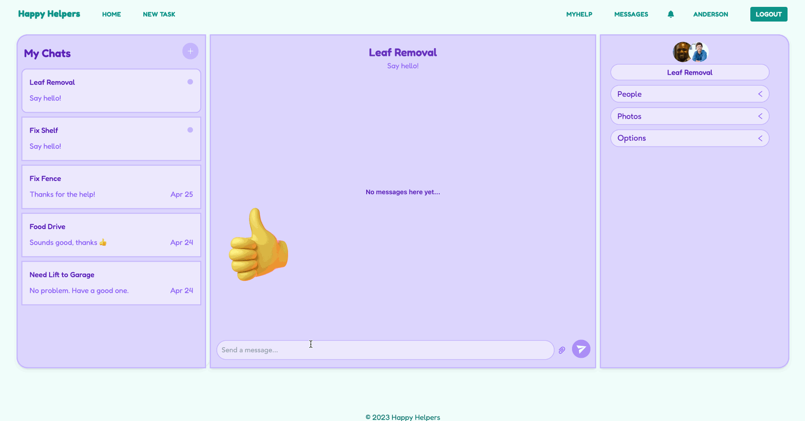

<p align="center" width="100%">
    
</p>

<p align="center" >A crowd-sourcing volunteering app with a focus on building community through in-person interactions and mutual aid. Whether you need a cup of milk from a neighbor, or help to fix a broken door; Happy Helpers can provide you with a volunteer.</p>

## How it Works?

- Users can post a task they need help with or browse upcoming tasks which can be filtered by location, category and date.

- Offering help is simple: just find a task you want to volunteer for and hit OFFER. Once an offer comes in for one of your own tasks, you can view the profiles of the volunteers and select the best match.

- After being accepted for a task, you can view it on your profile page with more information. The embedded Chat Engine lets you ensure that everything is in place as you patiently wait for the day to come to help or be helped by your neighbor.

- Once the task is finished, you can check it complete and reward your volunteer with a star, if deserved. Stars show up on your profile to show others they can rely on you to get the job done!

## Purpose

Happy Helpers has been created by Web Development students John Ross, Sarah Campbell, Alric Fernandes, and Mike Dalton for the Finals project at Lighthouse Labs.

## Tech Stack


<p float="left">
  
  
</p>


## Screenshots

The landing page:



The home page:


The new task page:


The task page:


The myHelp page:


The profile page:


The messages page:




## Setup

- Clone the project from the GitHub repository <https://github.com/tronross/happy-helpers>.

- Install dependencies with `npm install`.

- Create a `.env.local` file and add your Google Maps Api public key in the form:

  `NEXT_PUBLIC_API_KEY="your key here"`.
  - If needed, you can sign up for a free development account at:

    <https://developers.google.com/maps/documentation/javascript/get-api-key>.

- Create a new PostgreSQL database using `CREATE DATABASE finals`.

- Seed the test data using the Prisma commands:

  `> npx prisma db push --force-reset`

  `> npx prisma db seed`

- Type `> npm run dev` to run the development server.

- Open the page <http://localhost:3000> in your browser and enjoy the site!


## Dependencies

- next: 13.2.4
- react: 18.2.0
- prisma/client
- tailwindcss
- axios
- dayjs
- eslint
- flowbite
- googlemaps/js-api-loader
- normalize.css
- react-chat-engine
- react-dom
- react-geocode
- react-scripts
- react-tailwindcss-datepicker
- react-xarrows
- tailwind-scrollbar-hide

## Project Directory Structure
```
finals
├── planning
└──  prisma
    ├── migrations
    ├── public
    │   └── images
    └── src
        ├── components
        │   └── taskForm
        ├── helpers
        ├── pages
        │   ├── api
        │   │   ├── addresses
        │   │   ├── messages
        │   │   ├── offers
        │   │   ├── organizations
        │   │   ├── tasks
        │   │   ├── offers
        │   │   └── users
        │   ├── profile-page
        │   └── task
        └── styles
```